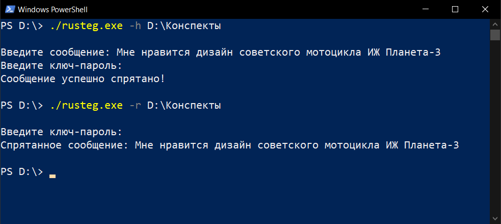

# RuSteg

RuSteg - это инструмент, позволяющий зашифровать и скрыть сообщение в директории с png-изображениями с помощью стеганографии. Для зашифровки сообщения используется ключ-пароль длиной не менее 4 символов. 



## Синтаксис

```
rusteg.exe -h [директория, в которую нужно спрятать информацию]
    
rusteg.exe -h [директория, в которую нужно спрятать информацию] -f [путь к файлу с сообщением]
    
rusteg.exe -r [директория, в которой спрятано сообщение]
    
rusteg.exe -r [директория, в которой спрятано сообщение] -f [путь к файлу, в который расшифрованное сообщение будет записано]
```

## Алгоритм сокрытия сообщения

1) Сообщение шифруется ключ-паролем
2) Подсчитывается количество png-изображений в выбранной директории
3) Если png-изображений не слишком много, зашифрованное сообщение разбивается на примерно равные части
4) Каждая часть нумеруется
5) Каждая часть ещё раз шифруется
6) Каждая часть скрывается в отдельном png-изображении

## Защита от «посторонних глаз»

При вводе ключ-пароля, он не печатается в терминале.

Если каким-то образом злоумышленник получит доступ к носителю информации и решит с помощью RuSteg расшифровать сообщение, у него это не получится без знания ключ-пароля.

Злоумышленник даже не узнает, скрыто ли какое-либо сообщение в выбранной директории.

Если хотя бы один символ в ключ-пароле неверный, то RuSteg сообщит, что в выбранной директории не найдено скрытое сообщение.

## Параметры

```
-h [спрятать сообщение (от англ. hide). После него указывается директория]

-r [раскрыть сообщение (от англ. reveal). После него указывается директория]

-f [считать из файла / записать в файл]
```
Для корректной работы необходимо соблюдать порядок действий:
```
rusteg.exe -h [DIR] -f [FILE]
```
либо 
```
rusteg.exe -r [DIR] -f [FILE]
```

## Примеры использования

Если мы хотим скрыть сообщение, которое напечатаем в терминале, то введём команду:
```
rusteg.exe -h D:\Photos\Выпускной\
```
Если же нужно скрыть сообщение, записанное в файле msg.txt, то напишем:
```
rusteg.exe -h D:\Photos\Выпускной\ -f msg.txt
```
В случае, если нам необходимо вывести спрятанное сообщение в терминал, введём команду:
```
rusteg.exe -r D:\Photos\Выпускной\
```
Если же нам нужно вывести спрятанное сообщение в файл out.txt, то мы напишем:
```
rusteg.exe -r D:\Photos\Выпускной\ -f out.txt
```

## Лицензия

Данное программное обеспечение распространяется под лицензией [GNU General Public License version 3](https://www.gnu.org/licenses/gpl-3.0.html).

Copyright (C) 2023 [Сафин Ильяс](https://github.com/ilyassafin).